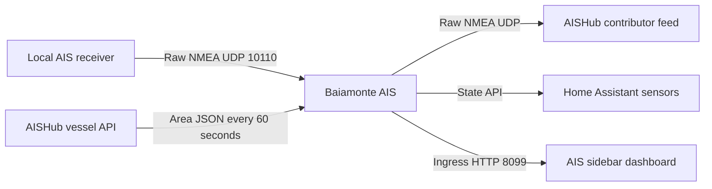

# Baiamonte AIS architecture

Baiamonte AIS is a reciprocal AISHub contributor and Home Assistant vessel dashboard.

## Runtime components

- A UDP listener accepts raw `!AIVDM`, `!AIVDO`, `!BSVDM`, and `!ABVDM` sentences from the estate receiver.
- A UDP forwarder sends valid sentences to the contributor destination assigned by AISHub.
- An HTTPS polling client retrieves human-readable JSON vessel records for the configured bounding box. The polling interval is never shorter than AISHub's required 60 seconds.
- The tracking layer normalizes vessel position and static fields, retains active contacts, and removes stale entities.
- A threaded HTTP server exposes the Tenuta Baiamonte-styled ingress dashboard and its read-only status endpoint.
- Home Assistant State API calls publish the connection, last-passing-ship, and optional per-vessel entities.

## Hardware observability

The receiver worker records its friendly name, source IP and port, datagram count, valid NMEA count, ignored-line count, forwarding count, last activity, and socket errors. It logs the first hardware contact, changes in source address, and a health summary approximately once per minute while data is arriving.

## Security and privacy

The AISHub username is redacted from errors before they are published to Home Assistant. The app does not send telemetry to a Baiamonte or third-party monitoring endpoint. Raw receiver data is forwarded only to the AISHub destination explicitly entered in the app configuration.

## Update delivery

GitHub Actions builds `amd64` and `aarch64` containers for the version in `ais_ship_tracker/config.yaml`, publishes the multi-architecture image to GHCR, and lets Home Assistant offer the new version through its app update mechanism.
